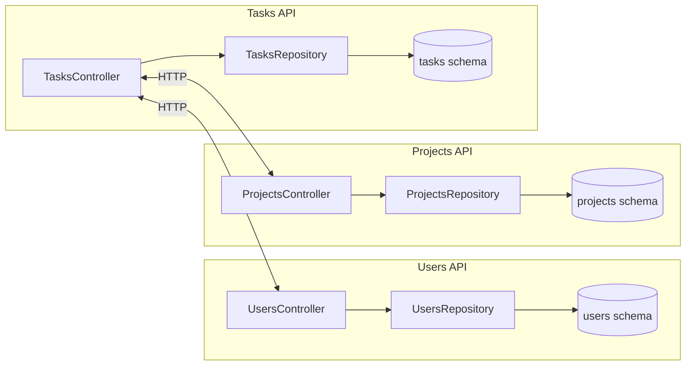

# Mini Gestor de Proyectos — UT3 TFU (FastAPI + Docker + ACID + UT4 Architectural Patterns)

Este repo incluye 4 APIs (autenticación, usuarios, proyectos y tareas) desplegadas con **Docker Compose**,
todas utilizando **PostgreSQL** y transacciones **ACID** a nivel de servicio (los servicios son *stateless*).

**Implementa 8 patrones arquitectónicos** de disponibilidad, rendimiento y seguridad:
- Health Endpoint Monitoring
- Circuit Breaker
- Retry with Exponential Backoff
- Rate Limiting (Multi-layer)
- Cache-Aside (Redis)
- Queue-Based Load Leveling (RabbitMQ)
- Gateway Offloading (nginx)
- Gatekeeper (JWT Auth)

Alineado con la consigna (componentes, interfaces, contenedores, ACID, servicios sin estado) de la UT3 TFU. Ver documento de la cátedra.

## Stack
- Python 3.11 + FastAPI + Uvicorn
- SQLAlchemy 2.x + psycopg2-binary
- PostgreSQL 16
- Redis 7 (caching)
- RabbitMQ 3 (message queue)
- nginx (API Gateway)
- Docker Compose

## Levantar todo
```bash
docker compose up --build
```

### Servicios disponibles

**APIs (acceso directo para desarrollo):**
- Auth API (Gatekeeper): http://localhost:8004/docs
- Users API: http://localhost:8001/docs
- Projects API: http://localhost:8002/docs
- Tasks API: http://localhost:8003/docs

**API Gateway (acceso producción):**
- Gateway: http://localhost:8080
- Users via Gateway: http://localhost:8080/api/users/
- Projects via Gateway: http://localhost:8080/api/projects/
- Tasks via Gateway: http://localhost:8080/api/tasks/

**Infraestructura:**
- RabbitMQ Management: http://localhost:15672 (guest/guest)
- PostgreSQL: localhost:5432 (postgres/postgres)
- Redis: localhost:6379

## Demostración rápida (curl)
```bash
# Crear usuario
curl -s -X POST http://localhost:8001/users -H "Content-Type: application/json" -d '{"name":"Mateo","email":"mateo@example.com"}' | jq

# Crear proyecto
curl -s -X POST http://localhost:8002/projects -H "Content-Type: application/json" -d '{"name":"TFU","owner_user_id":1}' | jq

# Crear tarea con actividad inicial (transacción ACID en el servicio de tareas)
curl -s -X POST http://localhost:8003/tasks -H "Content-Type: application/json" -d '{"title":"Preparar entrega","project_id":1,"assignee_user_id":1}' | jq

# Listar tareas
curl -s http://localhost:8003/tasks | jq
```

## Componentes e interfaces (resumen)
- **Users API**: CRUD de usuarios, con tabla `users` y `audit_logs` (demostración de transacción).
- **Projects API**: CRUD de proyectos.
- **Tasks API**: CRUD de tareas y `task_activities`. El endpoint de creación de tareas crea **dos filas** dentro de una **misma transacción** (ACID).

Cada servicio usa su **schema** propio en la misma base (`users`, `projects`, `tasks`), garantizando aislamiento lógico.
Los servicios no guardan estado en memoria entre requests (stateless), permitiendo **escalado horizontal**.

## UML (Mermaid)


> Nota: Las llamadas HTTP entre servicios son opcionales para la demo; las FKs se validan a nivel de datos desde cada servicio consultando por ID si así se desea (aquí se demuestra la parte ACID intra-servicio).

## ¿Por qué ACID y no BASE?
- ACID por claridad y simplicidad en un TP con una sola base lógica: transacciones atómicas al crear entidades relacionadas dentro de un mismo servicio (ej. `task` + `task_activity`).
- Si usáramos BASE, priorizaríamos disponibilidad y tolerancia a particiones, aceptando consistencia eventual (por ejemplo, colas/Event Sourcing). Implicaría complejidad adicional (reintentos, idempotencia, reconciliación).

## Contenedores vs. VMs
- **Contenedores**: levantan rápido, reproducibles, footprint bajo, fáciles de escalar horizontalmente.
- **VMs**: mayor aislamiento de SO, pero más pesadas y lentas de provisionar para esta demo.

## Estructura
```
services/
  users-api/
  projects-api/
  tasks-api/
docker-compose.yml
```

---

## Patrones Arquitectónicos

Este proyecto implementa **8 patrones arquitectónicos** para garantizar disponibilidad, rendimiento y seguridad.

### Patrones de Disponibilidad (4)

**1. Health Endpoint Monitoring**
- Monitoreo detallado de salud de cada servicio y sus dependencias
- Verifica: base de datos, Redis, RabbitMQ, y servicios dependientes
- Endpoint: `/health` en cada servicio

**2. Circuit Breaker**
- Previene fallos en cascada cortando llamadas a servicios que fallan
- Configuración: abre después de 5 fallos, timeout de 30 segundos
- Implementado en todas las llamadas inter-servicio

**3. Retry con Exponential Backoff**
- Reintentos automáticos con delays incrementales (2s, 4s, 8s)
- Máximo 3 intentos antes de fallar
- Maneja errores transitorios de red

**4. Rate Limiting**
- Capa 1 (Gateway): 10 req/s con burst de 20
- Capa 2 (App): 100 req/min por IP
- Protección contra abuso y DDoS

### Patrones de Rendimiento (2)

**5. Cache-Aside**
- Caché Redis con TTL de 5 minutos
- Reduce carga en base de datos ~10x
- Invalidación automática en create/update

**6. Queue-Based Load Leveling**
- Colas RabbitMQ para procesamiento asíncrono
- Suaviza picos de tráfico
- Workers en background procesan tareas

### Patrones de Seguridad (2)

**7. Gateway Offloading**
- nginx como API Gateway centralizado
- Maneja: routing, rate limiting, timeouts
- Punto de entrada único en puerto 8080

**8. Gatekeeper**
- Servicio dedicado de autenticación/autorización
- Emite y valida tokens JWT
- Control de acceso centralizado basado en roles

📖 **Documentación completa:** Ver [PATTERNS.md](./PATTERNS.md)

## Testing y Validación

### Scripts de Validación

```bash
cd validation-scripts

# Correr TODAS las pruebas (funcionales + patrones)
./run_all.sh

# Solo pruebas de patrones arquitectónicos
./run_pattern_tests.sh

# Pruebas individuales
./7_health_monitoring.sh       # Health Endpoint Monitoring
./8_cache_aside.sh              # Cache-Aside
./9_circuit_breaker_retry.sh    # Circuit Breaker + Retry
./10_rate_limiting.sh           # Rate Limiting
./11_queue_load_leveling.sh     # Queue-Based Load Leveling
./12_gateway_offloading.sh      # Gateway Offloading
./13_gatekeeper.sh              # Gatekeeper
```

### Pruebas Funcionales Originales
- `1_smoke.sh` - Smoke test básico
- `2_acid_tasks.sh` - Transacciones ACID
- `3_idempotency_users.sh` - Idempotencia
- `4_stateless_restart.sh` - Stateless + persistencia
- `5_schemas.sh` - Aislamiento por schemas
- `6_concurrency_users.sh` - Concurrencia

## Estructura del Proyecto

```
mini-gestor-proyectos/
├── docker-compose.yml          # Orquestación de servicios
├── README.md                   # Este archivo
├── PATTERNS.md                 # Documentación de patrones
├── gateway/
│   ├── nginx.conf              # Configuración API Gateway
│   └── rate-limit-zones/
├── services/
│   ├── users-api/
│   │   ├── app.py              # API con patrones integrados
│   │   ├── patterns.py         # Implementación de patrones
│   │   ├── queue.py            # Queue-based load leveling
│   │   ├── models.py
│   │   ├── schemas.py
│   │   ├── db.py
│   │   └── requirements.txt
│   ├── projects-api/           # Estructura similar
│   └── tasks-api/              # Estructura similar
└── validation-scripts/
    ├── run_all.sh              # Ejecuta todas las pruebas
    ├── run_pattern_tests.sh    # Solo patrones
    ├── 1_smoke.sh ... 6_concurrency_users.sh
    └── 7_health_monitoring.sh ... 12_gateway_offloading.sh
```

## Tecnologías de Patrones

| Patrón | Tecnología | Propósito |
|--------|-----------|-----------|
| Health Monitoring | FastAPI | Monitoreo de salud |
| Circuit Breaker | pybreaker | Prevenir fallos en cascada |
| Retry | tenacity | Reintentos con backoff |
| Rate Limiting | Redis + nginx | Prevenir abuso |
| Cache | Redis | Mejorar rendimiento |
| Queue | RabbitMQ | Nivelar carga |
| Gateway | nginx | Centralizar seguridad |
| Gatekeeper | JWT/FastAPI | Autenticación/Autorización |

---

> **Scripting de demostración:** ver comandos curl arriba y scripts en `validation-scripts/`
> 
> Los servicios inicializan sus **schemas** si no existen y están diseñados para **escalado horizontal**.
