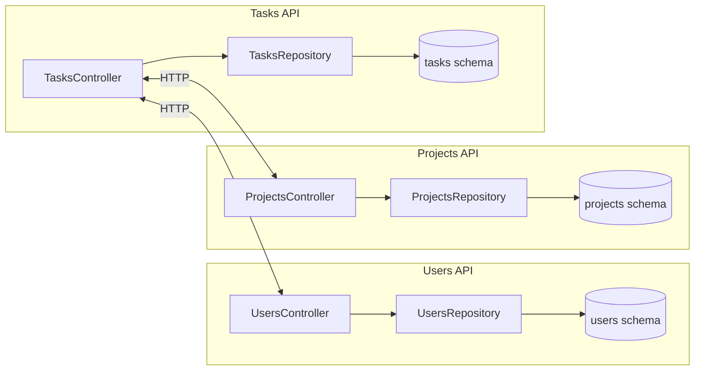

# Mini Gestor de Proyectos — UT3 TFU (FastAPI + Docker + ACID)

Este repo incluye 3 APIs (usuarios, proyectos y tareas) desplegadas con **Docker Compose**,
todas utilizando **PostgreSQL** y transacciones **ACID** a nivel de servicio (los servicios son *stateless*).

Alineado con la consigna (componentes, interfaces, contenedores, ACID, servicios sin estado) de la UT3 TFU. Ver documento de la cátedra.

## Stack
- Python 3.11 + FastAPI + Uvicorn
- SQLAlchemy 2.x + psycopg2-binary
- PostgreSQL 16
- Docker Compose

## Levantar todo
```bash
docker compose up --build
```

APIs:
- Users API: http://localhost:8001/docs
- Projects API: http://localhost:8002/docs
- Tasks API: http://localhost:8003/docs

## Demostración rápida (curl)
```bash
# Crear usuario
curl -s -X POST http://localhost:8001/users -H "Content-Type: application/json" -d '{"name":"Mateo","email":"mateo@example.com"}' | jq

# Crear proyecto
curl -s -X POST http://localhost:8002/projects -H "Content-Type: application/json" -d '{"name":"TFU","owner_user_id":1}' | jq

# Crear tarea con actividad inicial (transacción ACID en el servicio de tareas)
curl -s -X POST http://localhost:8003/tasks -H "Content-Type: application/json" -d '{"title":"Preparar entrega","project_id":1,"assignee_user_id":1}' | jq

# Listar tareas
curl -s http://localhost:8003/tasks | jq
```

## Componentes e interfaces (resumen)
- **Users API**: CRUD de usuarios, con tabla `users` y `audit_logs` (demostración de transacción).
- **Projects API**: CRUD de proyectos.
- **Tasks API**: CRUD de tareas y `task_activities`. El endpoint de creación de tareas crea **dos filas** dentro de una **misma transacción** (ACID).

Cada servicio usa su **schema** propio en la misma base (`users`, `projects`, `tasks`), garantizando aislamiento lógico.
Los servicios no guardan estado en memoria entre requests (stateless), permitiendo **escalado horizontal**.

## UML (Mermaid)


> Nota: Las llamadas HTTP entre servicios son opcionales para la demo; las FKs se validan a nivel de datos desde cada servicio consultando por ID si así se desea (aquí se demuestra la parte ACID intra-servicio).

## ¿Por qué ACID y no BASE?
- ACID por claridad y simplicidad en un TP con una sola base lógica: transacciones atómicas al crear entidades relacionadas dentro de un mismo servicio (ej. `task` + `task_activity`).
- Si usáramos BASE, priorizaríamos disponibilidad y tolerancia a particiones, aceptando consistencia eventual (por ejemplo, colas/Event Sourcing). Implicaría complejidad adicional (reintentos, idempotencia, reconciliación).

## Contenedores vs. VMs
- **Contenedores**: levantan rápido, reproducibles, footprint bajo, fáciles de escalar horizontalmente.
- **VMs**: mayor aislamiento de SO, pero más pesadas y lentas de provisionar para esta demo.

## Estructura
```
services/
  users-api/
  projects-api/
  tasks-api/
docker-compose.yml
```

---

> Scripting de demostración: ver `README` (curl). Los servicios inicializan sus **schemas** si no existen.# ANDIS2_TFU
# ANDIS2_TFU
